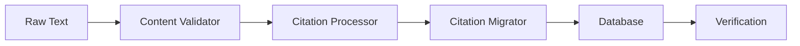
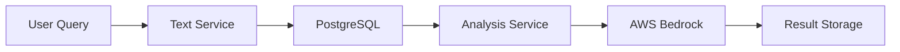

# New Architecture Codebase Summary

## Project Structure

```
ancient_texts/
├── alembic/                    # Database migrations
│   └── versions/               # Migration scripts
├── app/                        # Main application code
│   ├── api/                    # API endpoints
│   │   ├── corpus.py          # Text operations
│   │   ├── lexical.py         # Lemma operations
│   │   └── llm.py             # LLM analysis
│   ├── core/                   # Core functionality
│   │   ├── config.py          # Configuration with LLM support
│   │   └── database.py        # Database connection
│   ├── models/                 # Database models
│   │   ├── author.py          # Author model
│   │   ├── text.py            # Text model
│   │   ├── text_division.py   # Text division model
│   │   ├── text_line.py       # Text line model
│   │   ├── lemma.py           # Lemma model
│   │   └── lemma_analysis.py  # Analysis model
│   └── services/              # Business logic
│       ├── corpus_service.py   # Text operations
│       ├── lexical_service.py  # Lemma management
│       ├── llm_service.py      # LLM operations
│       └── llm/               # LLM providers
│           ├── base.py        # Base interface
│           └── bedrock.py     # AWS implementation
├── toolkit/                   # Text Processing Toolkit
│   ├── migration/            # Migration tools
│   │   ├── citation_migrator.py    # Main migration tool
│   │   ├── content_validator.py    # Content validation
│   │   ├── citation_processor.py   # Citation processing
│   │   ├── view_texts.py          # Text viewing
│   │   └── view_texts_direct.py   # Direct DB access
│   ├── parsers/              # Text parsing
│   │   ├── citation.py       # Citation parser
│   │   └── text.py          # Text structure parser
│   ├── nlp/                  # NLP processing
│   │   ├── pipeline.py       # spaCy pipeline
│   │   └── processors.py     # Custom processors
│   └── loader/               # Database loading
│       ├── bulk.py          # Bulk insert operations
│       └── validation.py    # Data validation
└── tests/                    # Test suite
    ├── toolkit/             # Toolkit tests
    │   └── migration/       # Migration tests
    │       ├── test_citation_content_validation.py
    │       ├── test_citation_format_validation.py
    │       ├── test_citation_structural_validation.py
    │       ├── test_citation_basic_validation.py
    │       ├── test_citation_integration.py
    │       └── test_citation_performance.py
    ├── app/                 # Application tests
    └── integration/         # Integration tests
```

## Key Components

### 1. Database Models
#### Base Model
```python
class Base(AsyncAttrs, DeclarativeBase):
    """Base class for all models with timestamp tracking."""
    created_at: Mapped[datetime]
    updated_at: Mapped[datetime]
```

#### Author Model
```python
class Author(Base):
    """Stores author information with language support."""
    id: Mapped[int]
    name: Mapped[str]
    normalized_name: Mapped[Optional[str]]
    language_code: Mapped[Optional[str]]  # ISO language code
```

#### Text Model
```python
class Text(Base):
    """Manages text documents with reference tracking."""
    id: Mapped[int]
    author_id: Mapped[Optional[int]]
    title: Mapped[str]
    reference_code: Mapped[Optional[str]]  # [0057] format
    text_metadata: Mapped[Optional[Dict[str, Any]]]
```
#### TextDivision Model
```python
class TextDivision(Base):
    """Model for storing text divisions with both citation and structural components."""
    id: Mapped[int]
    text_id: Mapped[int]
    
    # Citation components
    author_id_field: Mapped[str]      # e.g., [0086]
    work_number_field: Mapped[str]     # e.g., [055]
    epithet_field: Mapped[Optional[str]]    # e.g., [Divis]
    fragment_field: Mapped[Optional[str]]   # Optional fragment reference
    
    # Structural components
    volume: Mapped[Optional[str]]      # Volume reference
    chapter: Mapped[Optional[str]]     # Chapter reference
    line: Mapped[Optional[str]]        # Line reference
    section: Mapped[Optional[str]]     # Section reference (e.g., 847a)
    
    # Title components
    is_title: Mapped[bool]
    title_number: Mapped[Optional[str]]  # Title reference number
    title_text: Mapped[Optional[str]]    # Title content
    
    # Additional metadata
    division_metadata: Mapped[Optional[Dict[str, Any]]]
```

#### TextLine Model
```python
class TextLine(Base):
    """Stores text content with NLP analysis."""
    id: Mapped[int]
    division_id: Mapped[int]
    line_number: Mapped[int]
    content: Mapped[str]
    categories: Mapped[List[str]]  # For efficient category queries
    spacy_tokens: Mapped[Optional[Dict[str, Any]]]
```

#### Lemma Model
```python
class Lemma(Base):
    """Manages lemmatized words and translations."""
    id: Mapped[int]
    lemma: Mapped[str]
    language_code: Mapped[Optional[str]]
    categories: Mapped[List[str]]
    translations: Mapped[Optional[Dict[str, Any]]]
```

#### LemmaAnalysis Model
```python
class LemmaAnalysis(Base):
    """Stores LLM-generated analyses with citations."""
    id: Mapped[int]
    lemma_id: Mapped[int]
    analysis_text: Mapped[str]
    analysis_data: Mapped[Optional[Dict[str, Any]]]
    citations: Mapped[Optional[Dict[str, Any]]]
    created_by: Mapped[str]
```

### 2. Text Processing Toolkit
The toolkit now includes several core components:

#### Migration Components
```python
# CitationMigrator - Main migration tool
class CitationMigrator:
    """Handles migration of citations to PostgreSQL database."""
    async def process_text_file(self, file_path: Path) -> None
    async def migrate_directory(self, directory: Path) -> None
    async def migrate_section(self, citation: str, text: str) -> None

# ContentValidator - Validates text content
class ContentValidator:
    """Validates text content for migration."""
    MAX_CONTENT_LENGTH = 10000
    INVALID_UNICODE = [(0xFFFE, 0xFFFF), (0x1FFFE, 0x1FFFF)]
    INVALID_ASCII = set(range(0x00, 0x20)) | {0x7F} | set(range(0x80, 0xA0))

    @classmethod
    def validate(cls, content: str) -> None

# CitationProcessor - Handles citation processing
class CitationProcessor:
    """Processes citations and their components."""
    def extract_bracketed_values(self, citation: str) -> Dict[str, Optional[str]]
    def extract_line_info(self, line: str) -> Tuple[str, bool, int]
    def split_sections(self, text: str) -> list
```

#### Parser Components
```python
# Citation Parser - Handles all citation formats
class CitationParser:
    """Parses TLG references [0057][001][1][2], volume refs (128.32.5), and title refs (.t.1)"""
    def parse_citation(self, text: str) -> Tuple[str, Optional[Citation]]

# Text Parser - Handles text extraction and cleaning
class TextParser:
    """Extracts and processes text while preserving citations"""
    async def parse_file(self, file_path: Path) -> List[TextLine]

# Sentence Parser - Handles sentence-level processing
class SentenceParser:
    """Splits text into sentences while maintaining line references"""
    async def parse_lines(self, lines: List[TextLine]) -> List[Sentence]
```
### 3. Testing Structure

#### Validation Tests
```python
# Content Validation Tests
class TestContentValidation:
    """Tests text content validation."""
    async def test_basic_content_validation()
    async def test_unicode_content_validation()
    async def test_special_characters_validation()
    async def test_content_length_validation()
    async def test_mixed_content_validation()

# Format Validation Tests
class TestCitationFormatValidation:
    """Tests citation format validation."""
    async def test_citation_format_validation()
    async def test_line_format_validation()
    async def test_mixed_format_validation()
    async def test_sequential_line_numbers()

# Structural Validation Tests
class TestStructuralValidation:
    """Tests relationship and structural validation."""
    async def test_hierarchical_relationships()
    async def test_division_ordering()
    async def test_line_number_continuity()
    async def test_metadata_consistency()
    async def test_title_line_uniqueness()
```

### 3. Service Layer

#### CorpusService
```python
class CorpusService:
    """Manages text operations and searches."""
    async def list_texts() -> List[Dict]
    async def search_texts(query: str, search_lemma: bool = False) -> List[Dict]
    async def get_text_by_id(text_id: int) -> Optional[Dict]
    async def search_by_category(category: str) -> List[Dict]
```

#### LexicalService
```python
class LexicalService:
    """Handles lemma operations."""
    async def create_lemma(lemma: str, ...) -> Dict
    async def get_lemma_by_text(lemma: str) -> Optional[Lemma]
    async def list_lemmas(language_code: Optional[str] = None) -> List[Dict]
    async def update_lemma(lemma: str, ...) -> Dict
    async def delete_lemma(lemma: str) -> bool
```

#### LLMService
```python
class LLMService:
    """Manages LLM operations with provider abstraction."""
    async def analyze_term(term: str, contexts: List[Dict]) -> LLMResponse
    async def get_token_count(text: str) -> int
    async def check_context_length(prompt: str) -> bool
```

### 4. API Layer

#### Corpus Routes
- GET `/corpus/list`: List all texts
- POST `/corpus/search`: Search texts
- GET `/corpus/text/{text_id}`: Get text by ID
- GET `/corpus/category/{category}`: Search by category

#### Lexical Routes
- POST `/lexical/create`: Create lemma
- GET `/lexical/get/{lemma}`: Get lemma
- GET `/lexical/list`: List lemmas
- PUT `/lexical/update`: Update lemma
- DELETE `/lexical/delete/{lemma}`: Delete lemma

#### LLM Routes
- POST `/llm/analyze`: Generate analysis
- POST `/llm/analyze/stream`: Stream analysis
- POST `/llm/token-count`: Count tokens


## Data Flow

1. Text Processing Flow (Updated)


2. Analysis Flow


## Key Interactions

### Database Interactions
- SQLAlchemy models for type-safe queries
- Async operations with connection pooling
- Transaction management for data integrity

### API Layer
- FastAPI endpoints with OpenAPI documentation
- Request validation with Pydantic models
- Background tasks for long operations

### External Services
- AWS Bedrock integration for LLM analysis
- spaCy for NLP processing
- Redis for caching (optional)

## Performance Considerations

### Optimization Points
1. Bulk database operations
2. Connection pooling
3. Query optimization
4. Caching strategies
5. Background processing

### Monitoring
- Performance metrics collection
- Query timing analysis
- Resource usage tracking

## Security Measures

1. Input Validation
- Request validation
- Data sanitization
- Citation format verification

2. Database Security
- Connection pooling
- Prepared statements
- Transaction isolation

3. API Security
- Authentication
- Rate limiting
- CORS configuration

## Error Handling

### Error Types
1. Content Validation Errors
   - Empty content
   - Invalid characters
   - Length violations
2. Citation Format Errors
   - Invalid brackets
   - Wrong number format
   - Sequence errors
3. Structural Errors
   - Relationship violations
   - Ordering issues
   - Uniqueness violations
4. Database Errors
5. Analysis Errors
6. External Service Errors

### Recovery Strategies
- Retry mechanisms
- Fallback options
- Error logging
- User feedback

## Maintenance Procedures

### Database Maintenance
- Regular backups
- Index optimization
- Query analysis

### Code Maintenance
- Regular updates
- Dependency management
- Performance monitoring

This summary provides an overview of the new architecture's codebase structure and key components. It will be updated as the implementation progresses and new patterns or requirements emerge.